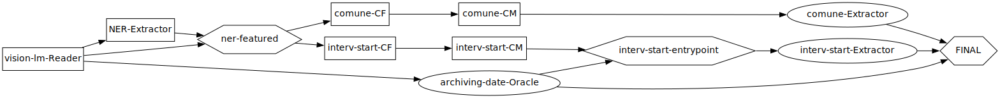
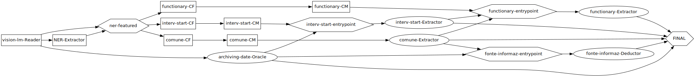

# About the project

The code in its current state is produced after an internship of 2–3 months by
one supervised software/AI engineer intern. It was a first work of exploration
of the data and the useful technologies to try to extract as much
information as possible from the archaeological intervention reports with as
much confidence as possible.

This exploration is not exhaustive and the development of accurate models for
all the fields is only in a starting point. In this page, we describe what
should have been directly done or fixed to fully exploit the final code of this
first stage.

## Discoveries about the data and evaluation results

During the internship, a lot of knowledge has been acquired from contributors
of Magoh. Only the useful knowledge for the current code is referenced in the
Markdown files, in the `references/knowledge` directory. Other knowledge is
reported directly to the AI team of the Laboratorio Mappa.

Finally, some evaluation plots have been let in the `reports` directory, but
please read the notes about the experimental conditions before considering them
as a reference.

## Project limitations

- The repository currently acts as an evaluation sandbox; accuracy metrics are
  not yet formalized.
- Running the pipeline requires external tooling like `poetry`, `just`, and an
  accessible Ollama server.
- Training data must be reachable through external PostgreSQL and Minio
  services.
- Notebook experimentation depends on a separate Jupyter environment because
  development dependencies omit the Jupyter stack.

## TODO items mentioned in READMEs

- Extend the vLLM setup to also serve embedding models beyond the existing LLM
  endpoints【F:prompt_enhancing/models/vllm-models/README.md†L1-L11】.

## Main caveat

The `fit` call of the `FieldExtractor` child classes is supposed to compile an
optimized DSPy Module with an enhanced prompt from a training set of Examples.
However, the tracing shows that the saved DSPy optimized model does not seem to
use the optimized prompt. This should be fixed to surely exploit the
automatic-optimization feature of DSPy, which is the greatest feature of the
library.

## Missing features

### Extending the specialized DAG to the other fields

The project in its deadline enables to build this DAG:

But experiencing the using of inference rules from predictions of some
fields should have been evaluated, e.g. with the development of the following
extended DAG:

What is missing is therefore the implementing of *Extractors*/*Deductors* for
dependent fields.

Special abstract classes could be developed for Estimators that achieved those
tasks:

- `FieldOracle` : simulate a prediction given by the human directly (during the
training or the evaluation, we directly use the information from the
MagohDataset, as with the `ArchivingDateProvider`)
- `FieldDeductor` : only estimate the field from a set of rules, without
calling any DSPy module (so without using any LLM).

### Enhanced the logging of the DAG and the saving of the fitted models

- The integration of MLFlow inside the project should have been strengthened
with both these following features:
  - the support of SKLearn models for the logging, the tracing and
  the scoring
  - the logging of the dspy models' signatures (efforts have been
  made inside the code to explicitly declare those signatures, but the
  integration of dspy in mlflow is still experimental, so the logging of the
  signatures is not that easy)

Also, handling the saving feature of MLFlow for both the sklearn DAG and the
dspy optimized submodels inside could be a good software feature.
